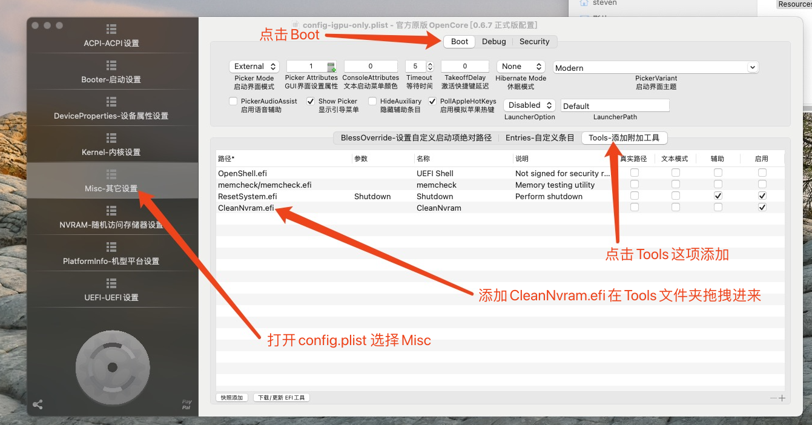

# Hackintosh-Intel-i7-10700k-ASUS-Z490m-plus-5500xt
* Hackintosh 10700k + 5500xt双风扇8g显卡

## 硬件配置
* CPU:i7-10700K
* 主板:华硕 PRIME Z490-PLUS
* 内存:三星DDR4 16G 3200MHZ
* 硬盘:intel 480g 企业盘（SSDSC2KW480H6）
* 声卡:ALC887 (仿冒id 99)
* 网卡:I219-V/华硕
* 独立显卡:AMD Radeon RX 5500 XT 8G /技嘉[显卡涨价太猛 已经卖掉回血]
* 无线网卡+蓝牙:fenvi FV-T919（BCM94360CD）

## 当前引导Bootlader
**Opencore 0.7.3**

## OpenCore 0.6.6升级0.7.3攻略
* 替换完efi后重启在开机引导选项那里选择CleanNvram 清空一下 否则开机后提示版本还是0.6.6

# 配置机芯文件和相关工具
* 机芯文件 随意修改了一个 自己根据图片 自己去修改吧
* 我这里下载的是OpenCore Configurator 2.19.0版本 
* 下载地址:[OpenCore Configurator 2.19.0版本](https://mackie100projects.altervista.org/download-opencore-configurator/)

* 我的电脑配置鲁大师截图

* 支持双显硬解码

# 安装选项
**Bios 设置**
* 关闭的选项（自行寻找）
    * Fast Boot
    * CSM
    * Thunderbolt
    * Intel SGX
    * CFG Lock (此主板直接关闭 "Bios version 0403")

* 开启的选项（自行寻找）
    * VT-x
    * 4G Decoding
    * Hyper-Threading
    * XHCI Hand-off
    * Os Type: Windows (您必须从安全启动菜单中删除所有安全密钥)
        * 如果不起作用，请选择 "Other Os"
    * **IMPORTANT:** 你必须设置 Onboard GPU（集成显卡） 内存为 64MB 使用集成显卡没有任何问题

# USB已经定制完成了
* 默认HS09和SH10应该还有SS09和SS10为USB 3.0 由于我用不到 所以没动 
* 主板接口是按照我的布线接的 大家可以根据参考自己修改接口 限制在15个接口内即可
下图为我的定制接口说明 大家自行研究 目前没问题

## 正常的选项
- [x] Intel UHD Graphics 630 (iGPU), 正常使用 **Metal Support** +5500 XT显卡 双显硬解码 工作正常 
- [x] 声卡Realtek ALC887 工作正常
- [x] Intel® I219V11 网卡工作正常
- [x] FV-T919 网卡蓝牙 工作正常 蓝牙USB已改内建
- [x] 睡眠/唤醒 工作正常
- [x] 重启和关机 工作正常

## 无法工作的内容
- [ ] 暂未发现.